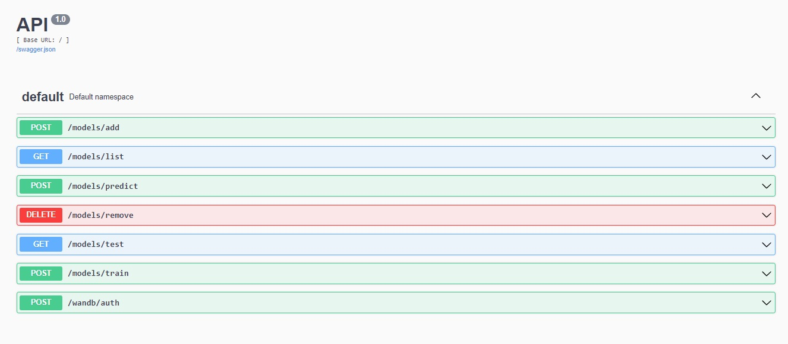

## ML models deployment with REST API and Weights & Biases

A REST API (also known as RESTful API) is an application programming interface (API or web API) that conforms to the constraints of REST architectural style and allows for interaction with RESTful web services. When a client request is made via a RESTful API, it transfers a representation of the state of the resource to the requester or endpoint. This information, or representation, is delivered in one of several formats. JSON is the most generally popular file format to use because, despite its name, it’s language-agnostic, as well as readable by both humans and machines. We can use REST API for creating interface to machine learning models for training, testing and predicting.

In this repository, I keep and maintain template for deployment of ML model with REST API and experiment tracking service ["Weights & Biases"](https://wandb.ai/). 

## API examples

W&B authentication with API key

```
curl -d 'key=YOUR_API_KEY' -X POST http://127.0.0.1:5000/wandb/auth
---
{
    "status": "login succesful"
}
```

Adding a model with given name, backbone type and device:

```
curl -d 'name=my_model&backbone_type=resnet18&device=cpu' -X POST http://127.0.0.1:5000/models/add
---
{
    "status": "OK",
    "message": "Model my_model created on cpu!"
}
```

Training a model with given name and training configuration. Besides, we can pass project and experiement names for W&B:

```
curl -d 'project_name=rest_api&experiment_name=exp6&model_name=my_model&dataset_path=animals_data&valid_part=0.1&batch_size=4&optimizer_name=Adam&learning_rate=0.01&freeze_backbone=true' -X POST http://127.0.0.1:5000/models/train
---
{
    "status": "OK",
    "message": "Best train score 0.5774999856948853"
}

```

Listing all added models

```
curl http://127.0.0.1:5000/models/list
---
{
    "status": "OK",
    "message": "Model my_model created on cpu!"
}
```

Removing a model with given name

```
curl -d 'name=my_model&backbone_type=resnet18&device=cpu' -X POST http://127.0.0.1:5000/models/remove
---
{
    "status": "OK",
    "message": "Model my_model created on cpu!"
}
```


## Swagger UI

The project supports [Swagger user interface](https://swagger.io/tools/swagger-ui/) that is used to visualize documentation and interact with the API's resources. It can be accessed by http://127.0.0.1:5000



## Changelog

`[17.02.2023]` initial commit
